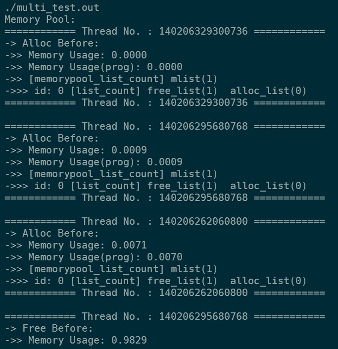

# My malloc
## 源文件
1. malloc1.cpp: 用linux的内核函数sbrk()代替malloc()，不支持free()操作
2. malloc2.cpp: 在malloc1.cpp的基础上增加链表，维护申请过的内存空间，支持free()操作
3. MemPool.cpp + example.cpp: 增加内存池功能，用完可自动扩展+测试 - lzy
4. 改进MemPool.cpp + multi_test.cpp: : 加锁线程安全+多线程测试 - ljx
5. Makefile - ljx

## 编译运行
Linux下：
- `make run_example`: 单线程测试
- `make run_multi_test`: 多线程测试

## 运行结果
- 单线程


- 多线程



......

(完整结果):
```
./multi_test.out
Memory Pool:
============ Thread No. : 140206329300736 ============
-> Alloc Before:
->> Memory Usage: 0.0000
->> Memory Usage(prog): 0.0000
->> [memorypool_list_count] mlist(1)
->>> id: 0 [list_count] free_list(1)  alloc_list(0)
============ Thread No. : 140206329300736 ============

============ Thread No. : 140206295680768 ============
-> Alloc Before:
->> Memory Usage: 0.0009
->> Memory Usage(prog): 0.0009
->> [memorypool_list_count] mlist(1)
->>> id: 0 [list_count] free_list(1)  alloc_list(0)
============ Thread No. : 140206295680768 ============

============ Thread No. : 140206262060800 ============
-> Alloc Before:
->> Memory Usage: 0.0071
->> Memory Usage(prog): 0.0070
->> [memorypool_list_count] mlist(1)
->>> id: 0 [list_count] free_list(1)  alloc_list(0)
============ Thread No. : 140206262060800 ============

============ Thread No. : 140206295680768 ============
-> Free Before:
->> Memory Usage: 0.9829
->> Memory Usage(prog): 0.9781
->> [memorypool_list_count] mlist(3)
->>> id: 2 [list_count] free_list(1)  alloc_list(0)
->>> id: 1 [list_count] free_list(1)  alloc_list(0)
->>> id: 0 [list_count] free_list(1)  alloc_list(0)
============ Thread No. : 140206295680768 ============

============ Thread No. : 140206329300736 ============
-> Free Before:
->> Memory Usage: 0.9125
->> Memory Usage(prog): 0.9082
->> [memorypool_list_count] mlist(4)
->>> id: 3 [list_count] free_list(1)  alloc_list(0)
->>> id: 2 [list_count] free_list(1)  alloc_list(0)
->>> id: 1 [list_count] free_list(1)  alloc_list(0)
->>> id: 0 [list_count] free_list(1)  alloc_list(0)
============ Thread No. : 140206329300736 ============

============ Thread No. : 140206262060800 ============
-> Free Before:
->> Memory Usage: 0.7405
->> Memory Usage(prog): 0.7372
->> [memorypool_list_count] mlist(5)
->>> id: 4 [list_count] free_list(1)  alloc_list(0)
->>> id: 3 [list_count] free_list(1)  alloc_list(0)
->>> id: 2 [list_count] free_list(1)  alloc_list(0)
->>> id: 1 [list_count] free_list(1)  alloc_list(0)
->>> id: 0 [list_count] free_list(1)  alloc_list(0)
============ Thread No. : 140206262060800 ============


============ Thread No. : 140206295680768 ============
-> Free After:
->> Memory Usage: 0.1979
->> Memory Usage(prog): 0.1973
->> [memorypool_list_count] mlist(5)
->>> id: 4 [list_count] free_list(1)  alloc_list(0)
->>> id: 3 [list_count] free_list(1)  alloc_list(0)
->>> id: 2 [list_count] free_list(1)  alloc_list(0)
->>> id: 1 [list_count] free_list(1)  alloc_list(0)
->>> id: 0 [list_count] free_list(1)  alloc_list(0)
============ Thread No. : 140206295680768 ============

Memory Pool Size: 1536.0000 MB
Total Usage Size: 391.7815 MB

============ Thread No. : 140206329300736 ============
-> Free After:
->> Memory Usage: 0.0998
->> Memory Usage(prog): 0.0995
->> [memorypool_list_count] mlist(5)
->>> id: 4 [list_count] free_list(1)  alloc_list(0)
->>> id: 3 [list_count] free_list(1)  alloc_list(0)
->>> id: 2 [list_count] free_list(1)  alloc_list(0)
->>> id: 1 [list_count] free_list(1)  alloc_list(0)
->>> id: 0 [list_count] free_list(1)  alloc_list(0)
============ Thread No. : 140206329300736 ============

Memory Pool Size: 1536.0000 MB
Total Usage Size: 782.1762 MB

============ Thread No. : 140206262060800 ============
-> Free After:
->> Memory Usage: 0.0000
->> Memory Usage(prog): 0.0000
->> [memorypool_list_count] mlist(5)
->>> id: 4 [list_count] free_list(1)  alloc_list(0)
->>> id: 3 [list_count] free_list(1)  alloc_list(0)
->>> id: 2 [list_count] free_list(1)  alloc_list(0)
->>> id: 1 [list_count] free_list(1)  alloc_list(0)
->>> id: 0 [list_count] free_list(1)  alloc_list(0)
============ Thread No. : 140206262060800 ============

Memory Pool Size: 1536.0000 MB
Total Usage Size: 1172.9580 MB

Total time: 2.625000 seconds.
```
