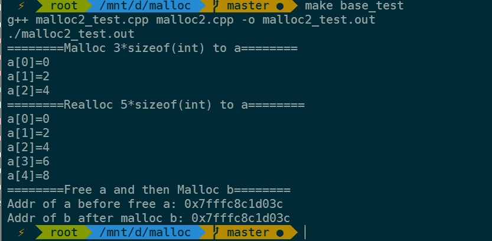
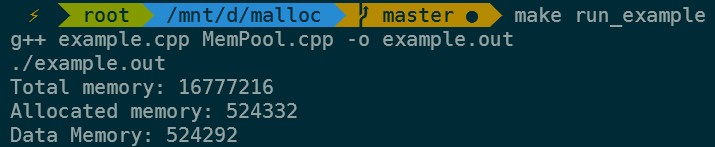
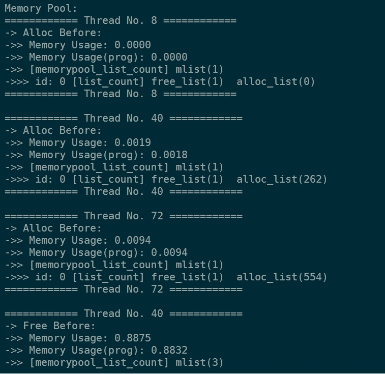
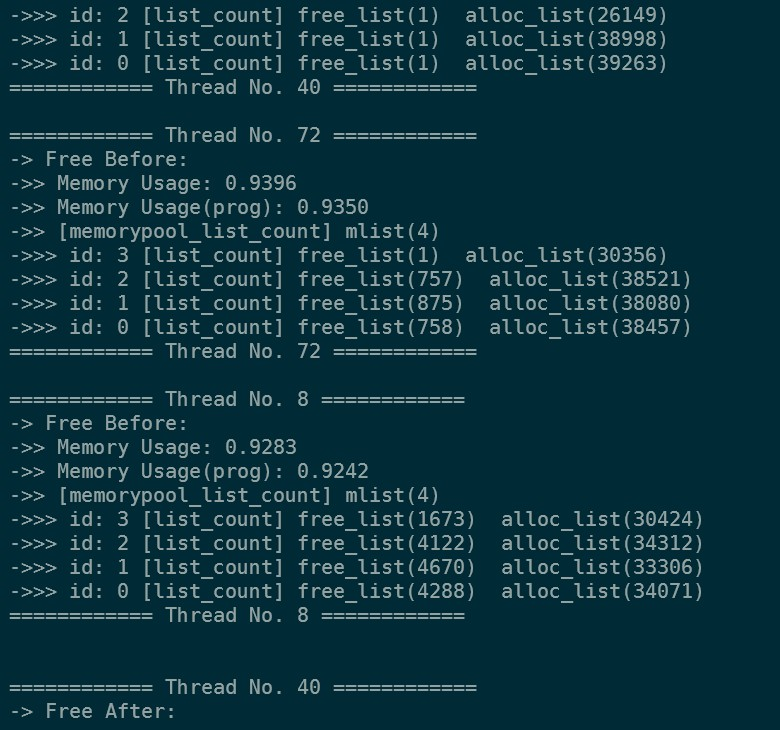
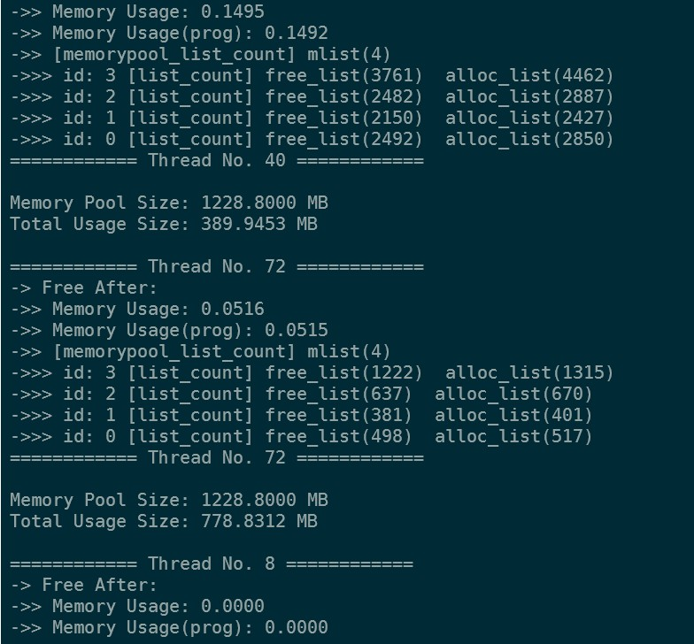
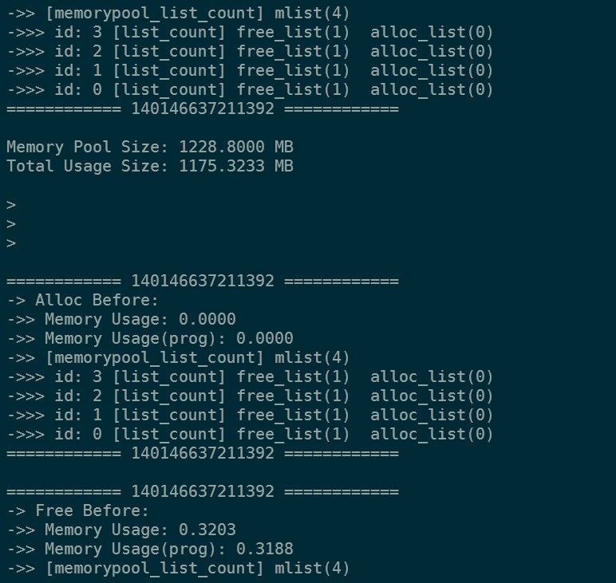
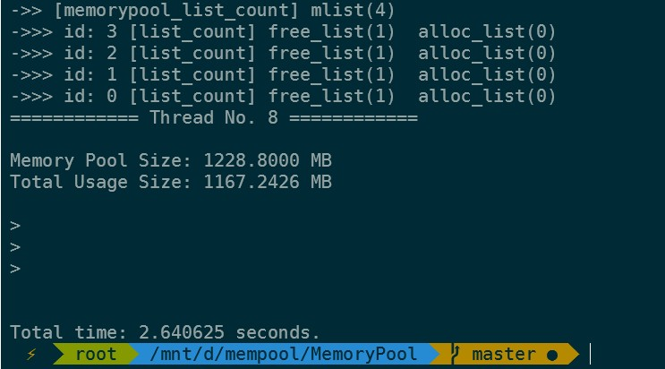
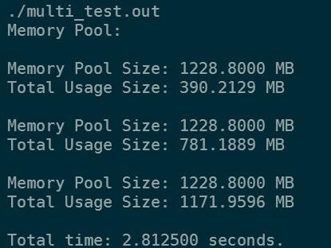

# My malloc
## Logs
- 创建`malloc1.cpp`: 用linux的内核函数sbrk()代替malloc()，实现my_malloc(), 不维护申请过的内存空间，不支持free()操作 - **LJX**
- 创建`malloc2.cpp`: 在malloc1.cpp的基础上增加结点头信息，增加my_free()，配合链表结构维护申请和释放的内存空间 - **LJX**
- 改进`malloc2.cpp`: 增加my_realloc()函数，重分配my_malloc()的内存空间 - **PS**
- 改进`malloc2.cpp`: 增加链表结点申请块split & 空闲块merge功能 - **MZR**
- 创建`malloc2_test.cpp`: 测试my_malloc + my_realloc + my_free - **LJX**
- 创建`MemPool.cpp` + 创建`single.cpp`: 增加内存池库功能，预先分配一大块进行管理，用完可自动扩展 + 测试 - **LZY**
- 改进`MemPool.cpp` + 创建`multi_test.cpp`: 利用锁保证多线程操作内存池库安全 + 多线程测试 - **LJX**
- 创建`Makefile` - **LJX**
- 维护`README.md` - **LJX**
## 编译运行

Linux下：
- `make base_test`: malloc + realloc + free 基础测试
- `make run_single_test`: 内存池测试（单线程）
- `make run_multi_test`: 内存池测试（多线程）

## 运行结果

- malloc + realloc + free 基础测试

- 内存池测试（单线程）

- 内存池测试（多线程）

- 内存池malloc与系统自带malloc性能比较

    - 内存池malloc
    
    
   
    - 系统自带malloc

    