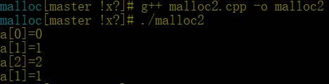

# My malloc
## 源文件
1. malloc1.cpp: 仅用linux的内核函数sbrk()实现不带free()的malloc().
2. malloc2.cpp: 在malloc1.cpp的基础上增加链表，维护申请过的内存空间，通过标志位free实现带free()的malloc()
## 编译运行
在Linux下安装g++并执行下列命令（以malloc2.cpp为例）：
1. `g++ malloc2.cpp -o malloc2`
2. `./malloc2`
